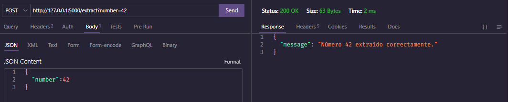
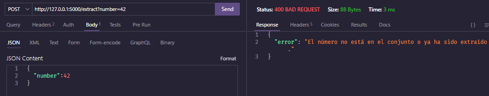
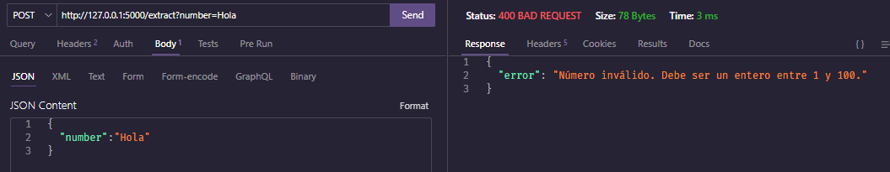
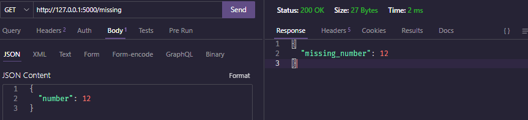

# Prueba tecnica Seccion 2: Creacion de un API

## Pasos 
- Navegar a la seccion 2. `cd .\seccion2\`
- Ejecutar la aplicacion Flask. `python app.py`
- Con uso de ThunderClient o el de su preferencia enviar el numero que desee extraer en formato JSON.

## Resultados

